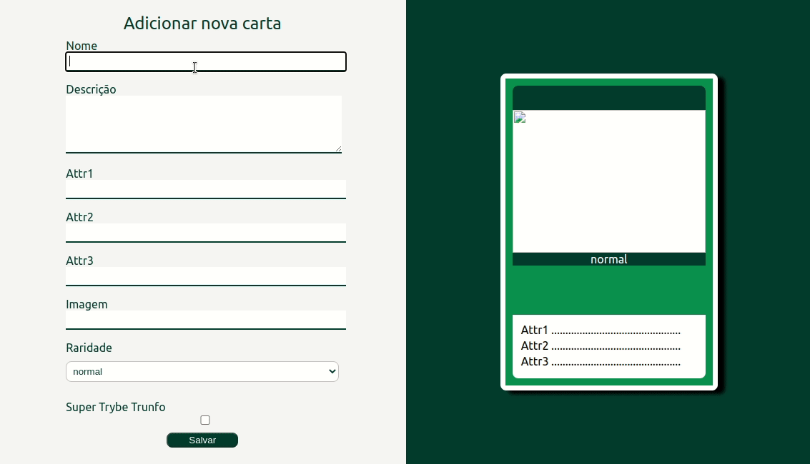

# Boas-vindas ao repositório do projeto Tryunfo!

Projeto desenvolvido no curso da Trybe ao final do bloco 11* do Módulo 2 - Desenvolvimento Front-end.  
*<strong>Bloco 11: Componentes com Estado, Eventos e Formulários com React</strong> 
 11.1 - Componentes com estado e eventos 
 11.2 - Formulários no React 
 11.3 - Projeto - Tryunfo 
 
 No projeto <strong>Tryunfo</strong> foi desenvolvido um formulário que após ser preenchido gera um carta tryunfo. As cartas salvas ficam disponíveis para visualização e podem ser filtradas pelo nome, raridade e Super Trybe Trunfo. 
 
 Veja o resultado: https://nataliafranceschi.github.io/11-Project-Tryunfo/
 
 
